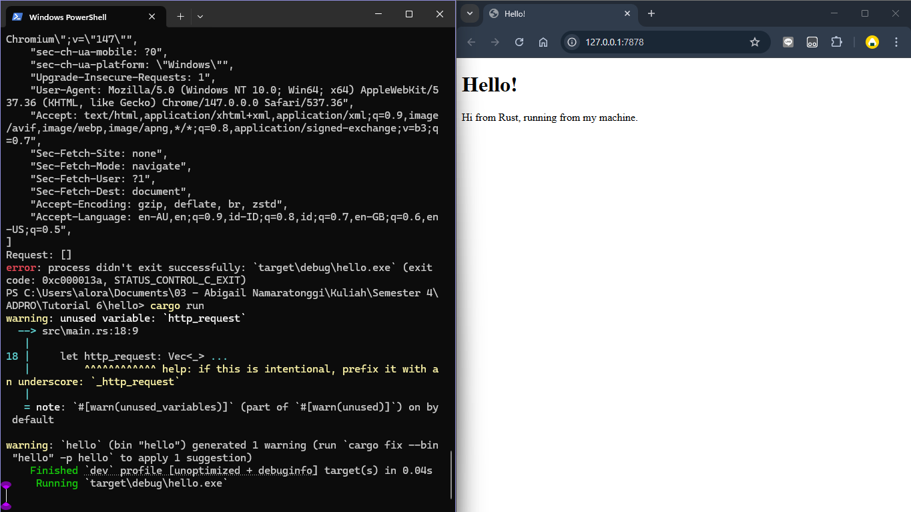
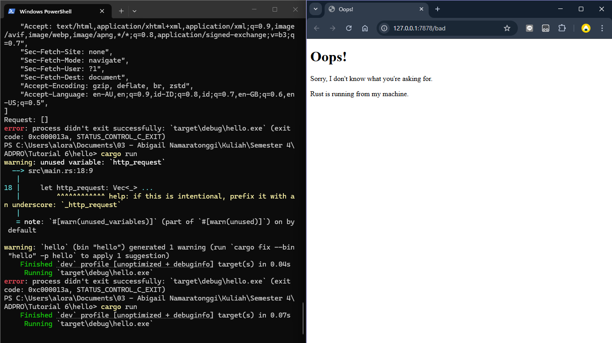

## Commit 1 Reflection notes
Fungsi `handle_connection` pada server ini bertujuan untuk membaca dan memproses data yang dikirimkan oleh browser (TCP Stream). 

Kita menggunakan `BufReader` untuk membaca aliran data tersebut baris per baris secara efisien. Kemudian, kode menggunakan metode seperti `.lines()`, `.map()`, dan `.take_while()` untuk memfilter teks HTTP request sampai menemukan baris kosong, lalu mengumpulkannya menjadi sebuah struktur data `Vec` (Vector) agar bisa dicetak di terminal.

## Commit 2 Reflection notes
Pada milestone ini, kita meng-upgrade `handle_connection` agar bisa membaca isi file `hello.html` dan mengembalikannya sebagai respons ke browser. 

Kita juga menambahkan header `Content-Length`. Header ini sangat penting karena memberi tahu browser ukuran pasti dari data (file HTML) yang dikirimkan. Dengan begitu, browser tahu kapan seluruh data telah selesai diunduh dan bisa langsung merendernya ke layar tanpa harus menunggu *connection timeout*.

## Commit 3 Reflection notes
Pada milestone ini, kita menambahkan validasi HTTP Request untuk memastikan server bisa merespons secara berbeda tergantung rute (URL) yang diakses. Jika *request line* adalah `GET / HTTP/1.1`, server merespons dengan `hello.html`. Jika selain itu, server membalas dengan status `404 NOT FOUND` dan halaman `404.html`.

**Kenapa perlu refactoring?**

Sebelum dilakukan refactoring, terdapat duplikasi kode pada proses pembacaan file dan penyusunan string respons HTTP di dalam blok `if` dan `else`. Hal ini melanggar prinsip *DRY (Don't Repeat Yourself)*. Dengan melakukan refactoring, kita hanya mengikat nilai `status_line` dan `filename` pada blok kondisi (menggunakan *pattern matching* atau *if-else* sebagai *expression*). Pembacaan file `fs::read_to_string` dan perakitan teks respons cukup ditulis satu kali saja di bagian akhir. Ini membuat kode jauh lebih *clean*, mudah dibaca, dan mudah di-maintenance jika nanti ada perubahan pada struktur respons.

## Commit 4 Reflection notes
Pada milestone ini, kita mensimulasikan respons lambat dengan menambahkan *route* `/sleep` yang akan melakukan `thread::sleep` selama 10 detik.

Ketika rute `/sleep` diakses pada satu tab browser, lalu kita mencoba mengakses rute normal (`/`) di tab lain secara bersamaan, *request* kedua tersebut tidak akan langsung diproses. Hal ini terjadi karena server yang kita bangun saat ini masih beroperasi secara *single-threaded*. Artinya, server hanya dapat menangani satu *TCP stream* secara sekuensial. *Request* kedua harus mengantre hingga proses *blocking* selama 10 detik dari *request* pertama selesai dieksekusi. Hal ini menunjukkan dibutuhkannya penerapan *multithreading* agar server dapat merespons *request* secara *concurrent*.

## Commit 5 Reflection notes
Pada milestone ini, *single-threaded server* berhasil diubah menjadi *multithreaded server* menggunakan *Thread Pool*. Kita menggunakan `mpsc::channel()` sebagai antrean pekerjaan (*job queue*). *Main thread* bertindak sebagai *producer* (menggunakan `sender` untuk mendistribusikan *closure*), sementara setiap *worker* di dalam *pool* bertindak sebagai *consumer*.

Karena sifat *mpsc* adalah *multiple producer, single consumer*, sisi *receiver* dari *channel* tidak bisa langsung dibagikan ke banyak *worker*. Oleh karena itu, *receiver* dibungkus dengan `Arc<Mutex<T>>`. `Mutex` memastikan perlindungan pada *Critical Section* sehingga hanya satu *worker* yang dapat mengambil dan mengeksekusi satu *request* pada satu waktu, sementara `Arc` (Atomic Reference Counting) memungkinkan referensi memori dari *receiver* tersebut dibagikan secara aman (*thread-safe*) ke seluruh *worker*.